# jbnu-se-team

2023년. 4학년 1학기. Software Engineering. 소프트웨어공학.

## 1. Development

### 1-1. Summary

소프트웨어공학 프로세스 전반에 대한 팀 프로젝트 진행.

### 1-2. Environment

Python3

### 1-3. Detailed

#### 1-3-2. 팀 프로젝트

#### 1-3-2-1. 1번 과제

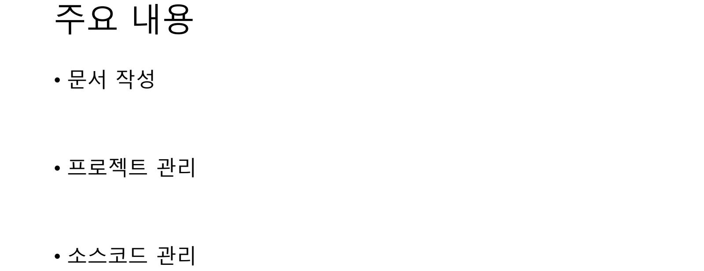
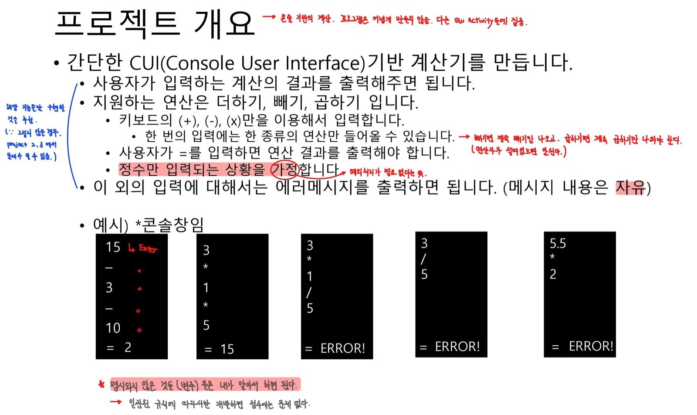
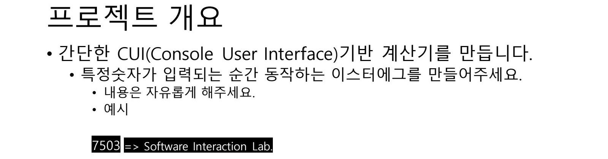
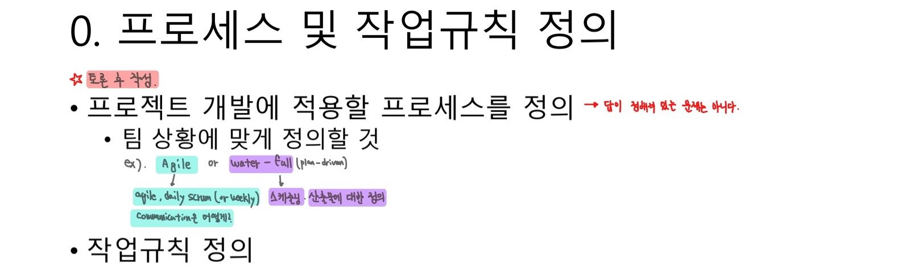
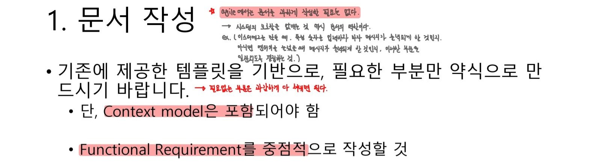
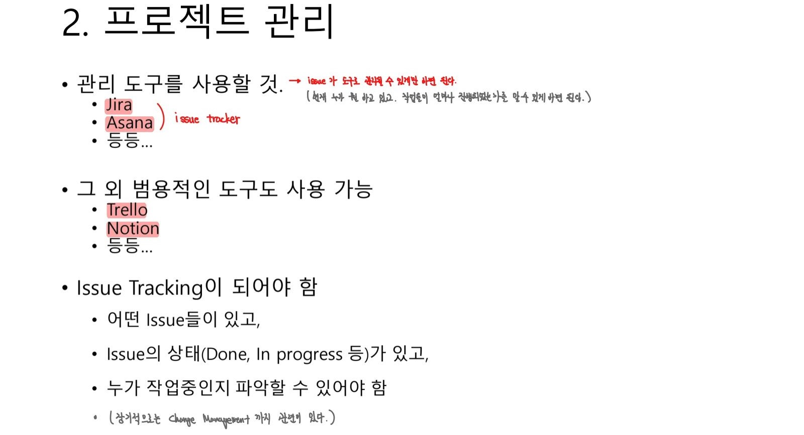
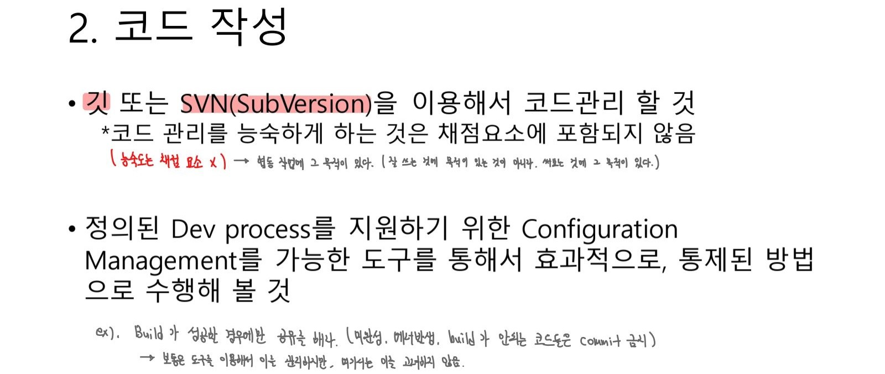
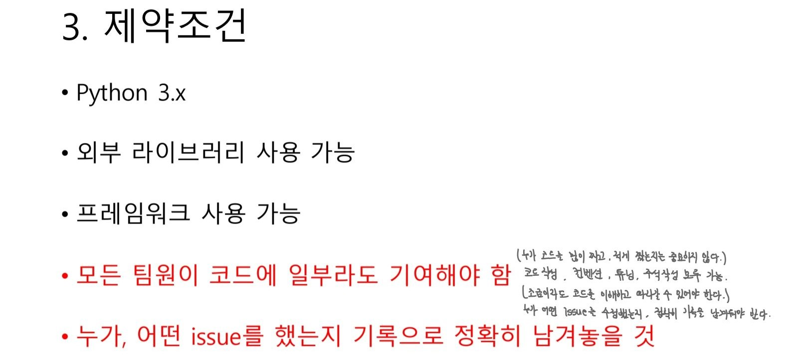
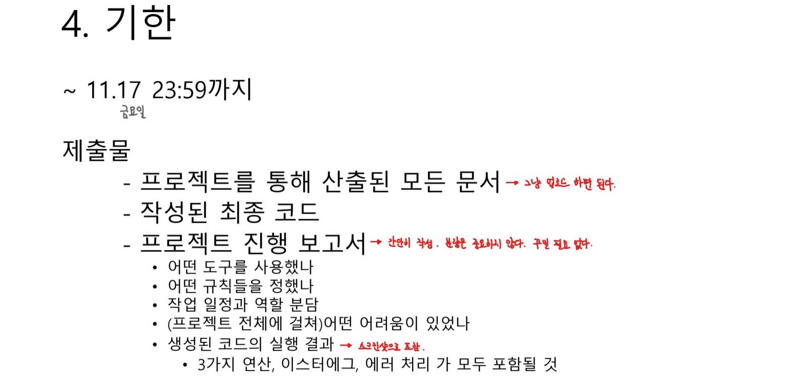

#### 1-3-2-2. 2, 3번 과제

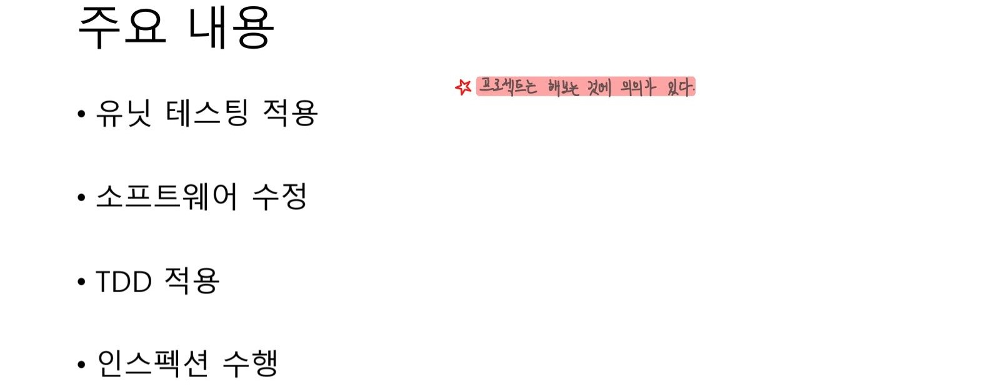
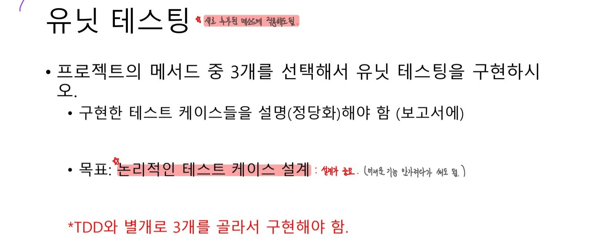
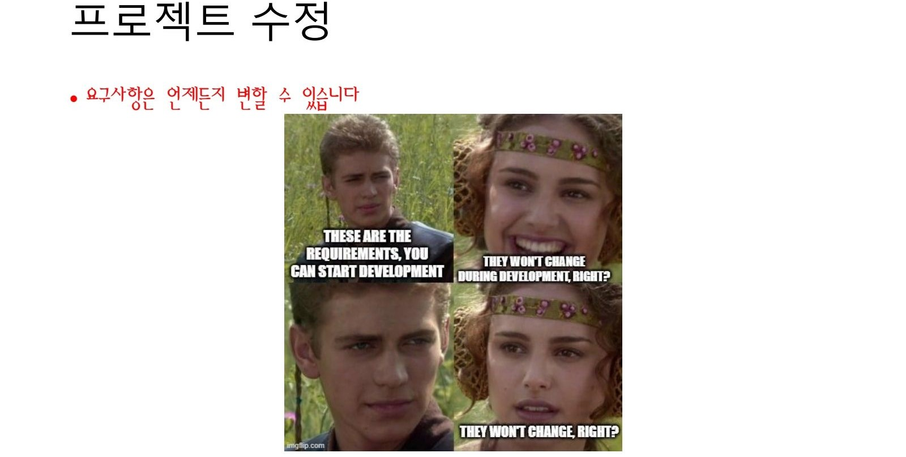
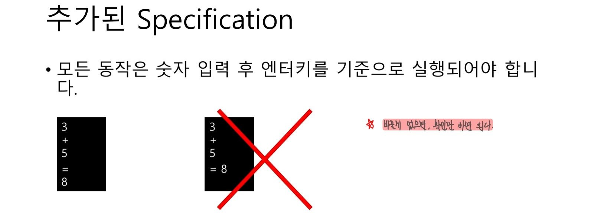
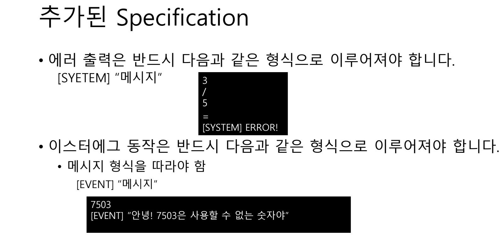
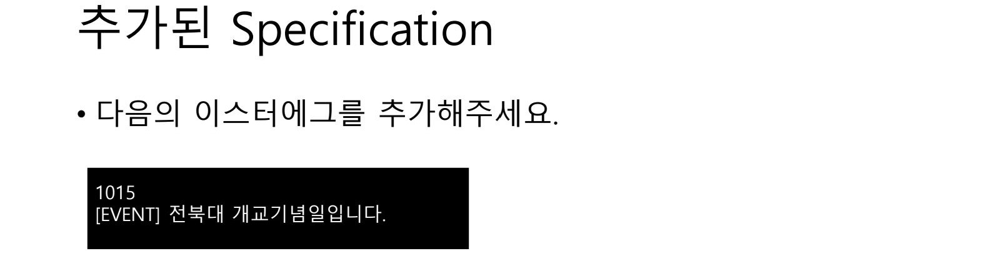
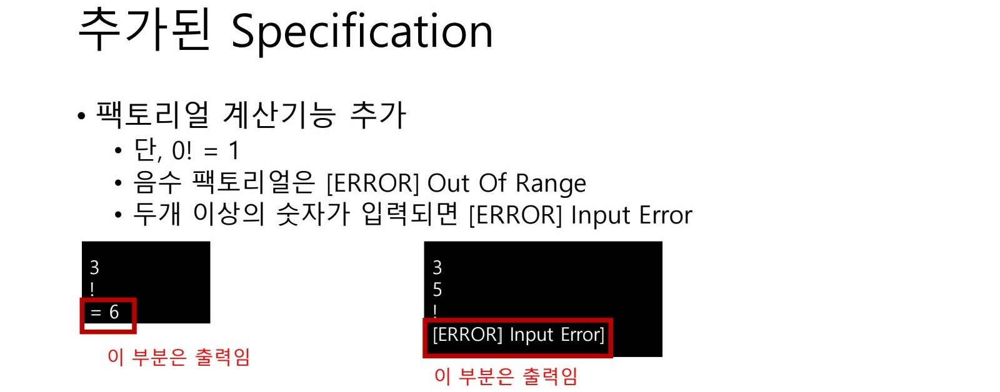
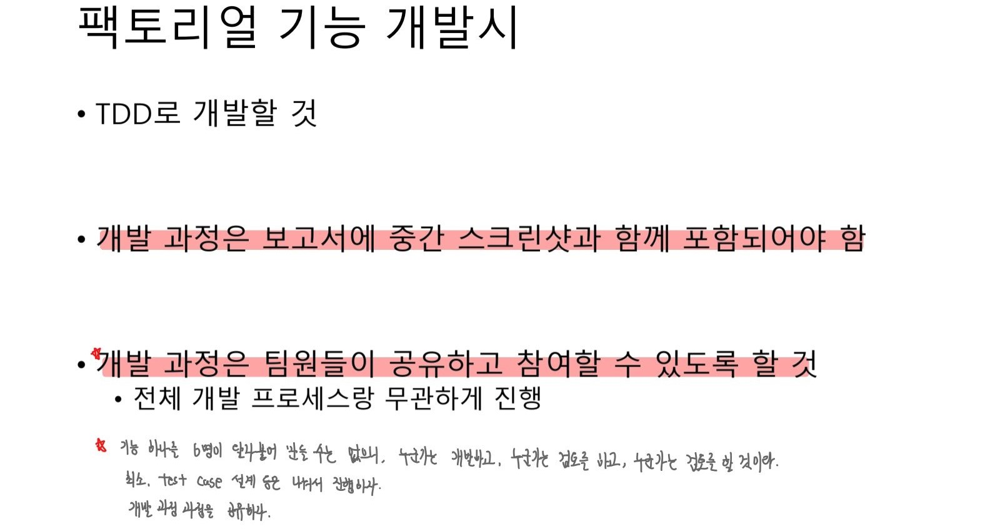
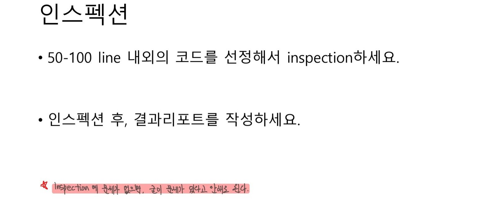
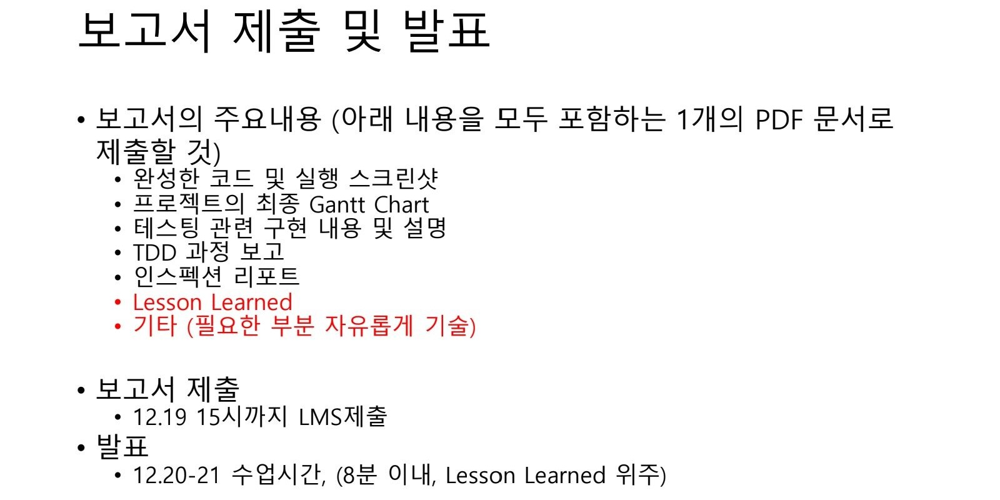
